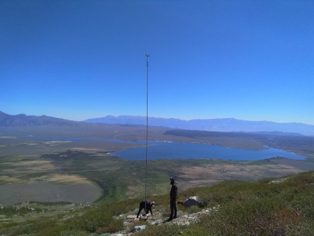
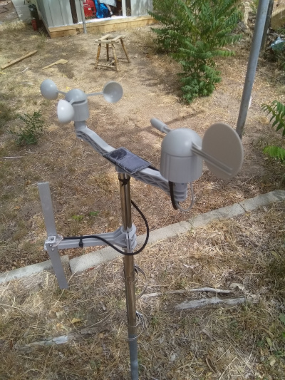
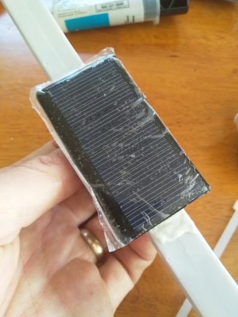
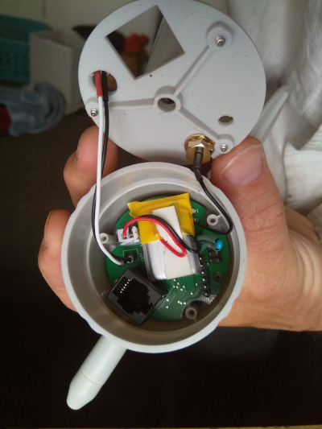
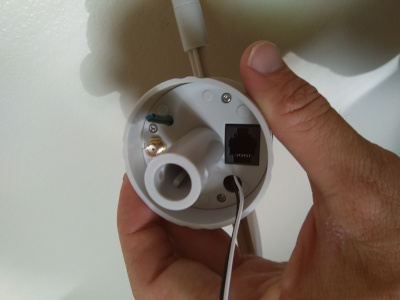
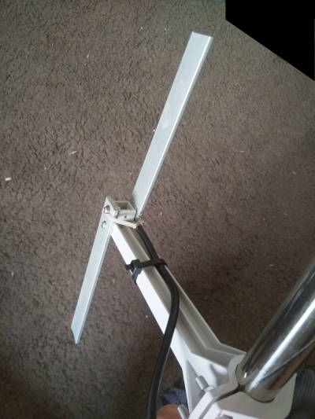
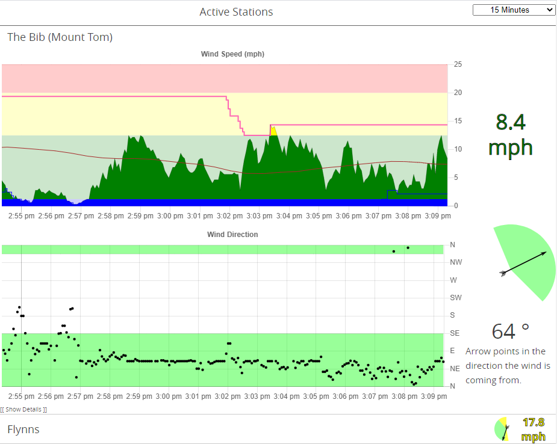

# Sierragliding weather stations

[Sierragliding.us](https://sierragliding.us)

This project contains the information necessary to build a simple low cost (~$130) low interval (4 second) weather station.
The weather stations report only wind speed, wind direction, and temperature.
The stations report over radio, using the LoRa protocol. On a low traffic channel with line of sight, these should be able to communicate over 100km.
The project includes a website to display historical data from the stations, and a simple app to post the data to Windy.

This document is a work-in-progress describing how to combine the various parts of the repository into a working station. Please contact me at \<My_Last_Name\>.BarryP@gmail.com if you're actually interested in building some of these and I'll finish it off.

 

To build and operate these stations, one should be a licensed amatuer radio (ham) operator. It might be legal to run the stations in the unlicensed ISM bands, I don't know nor do I want to go looking through the FCC regulations. Even if it is legal, operating in such bands will likely result in drastically worse performance: Lower range and more dropped packets.

All up component cost is around $75 per station, depending on how many stations one orders at the same time. This does not include the mounting pole.
My website to display the stations is hosted on Digital Ocean for $5/month, this is the only ongoing cost.

The weather stations consist of a custom circuit board installed in an off-the-shelf wind vane / anemometer combo.

Following is a description of how I have built my stations.

# Hardware
## Station
### Circuit boards
The weather station circuitry consists of:
 - atmega328PB: that acts as the main controller.
 - LoRa SX1268 module: that acts as a radio modem
 - ALS13131: 3 axis hall effect sensor to measure the orientation of the wind vane
 - battery charge control circuit (controlled by the atmega)
This is all mounted on a single board that fits inside of the wind vane housing (described below). I have had JLPCB make my circuit boards, and use their pick-and-place service to solder the components on the bottom side of the board. Sadly with the current design one must still hand solder all of the top components onto the board as well as the through hole components

I like to extend the solar panel connectors (the 2mm JST connector) with some 5cm leads so that can be routed outside of the main housing. This makes it easier to disconnect and remove the main part of the station from the rest of it.

TODO: A shopping list for all components, more instructions on getting a board made.

### Programming the board
The main circuit board has two programming headers: one for the SPI interface and one for the serial interface. The SPI interface is the 3x2 header, the Serial interface is the straight 6 header.

The first step in programming the board is to use the SPI header to set the fuses appropriately and install the bootloader. I use an arduino with a modified sketch from Gammon to install a copy of DualOptiBoot. TODO: Link that sketch. The weather station is not tolerant of 5V inputs, and all of the arduinos I have laying about are 5V. However, you can load the sketch onto the arduino, then disconnect it from your computer and connect it to the weather station board. Connect the weather station board to a battery and everything will run at the 3.3V the weather station is happy with. Alternatively, buy an arduino or programmer that works at 3.3V.

After installing the bootloader, upload the main weather station code using the serial interface. (TODO: Provide binaries).

A future TODO is to program the entire board through the SPI interface.

If everything has been done correctly, the red and green lights on the board should alternately flash on startup, then the red light should flash every four seconds as the station attempts to transmit a packet.

Once the board has been programmed the first time over the wired interfaces, subsequent updates can be applied using the over-the-air update mechanism. Of course, if anything goes seriously wrong and one cannot use the radio to communicate with the board anymore then the wired interface must be used to correct the problem.

### Solar panel
The stations require a 5V solar panel, rated to generate 20-100mA (250 - 500mW). You can find them cheap on Amazon, e.g. https://www.amazon.com/gp/product/B073Y3RQSC/

For repeater stations, use a panel that produces at least 50 mA.

I use epoxy to glue the solar panel on to the cross bar between the wind vane and the anemometer

The solar panel connects to the main board by a 2mm JST connector.



### Battery
I use single cell LiPos to run my stations. You can also run them on 4V lead acid batteries.

For end point stations, a 240mAh battery provides approximately ten days runtime without charge. I use these: https://hobbyking.com/en_us/zippy-240mah-20c-single-cell.html
For repeater stations, a larger battery with at least 1000mAh capacity is recommended. I use these: https://hobbyking.com/en_us/turnigy-2000mah-1s-1c-lipoly-w-2-pin-jst-ph-connector.html

The battery connects to the main board by a 2.5mm JST connector.

The small battery fits inside of the wind vane for a very clean self contained unit. Larger LiPos or lead acid batteries must be housed in a separate container.

### Wind Vane and Anemometer
The wind vane and anemometer used in these stations are some generic design from China. In the United States, the best source I have found is ArgentData, item: https://www.argentdata.com/catalog/product_info.php?products_id=145 .
One can contact the owner of that business to request to buy only the windvane and anemometer, not the rain guage, for $12 cheaper per unit.

### Wind vane modification
The wind vane as supplied only provides 8 possible wind directions (N, NE, E, SE, S, SW, W, and NW); we want to be able to report wind from any direction. To do this pull off the wind vane and glue some magnets to have a field paralell with the direction of the wind.
I used 4 magnets, each 2mm x 10mm, glued as shown in the picture: [TODO]

Remove the wind vane circuit board and install the custom circuit board. You can discard the board supplied with the vane. Be sure to program and test the main board before installing it!

The bottom of the wind vane needs to be modified for our connectors:
 - Enlarge the existing cable hole to be large enough to fit a 2mm JST connector through. A 5/8" drill will do well.
 - Create a new hole for the thermistor to hang out of the case. A 1/8" drill will work.
 - Create a new hole for the SMA connector. A 1/4" drill works.
  
When making these holes, ensure that the SMA connector will not touch and short out the programming pins on the board.

Connect the u.FL to SMA connector and the battery to the main board. Put some double sided tape on the battery to stop it moving about. Mount the SMA connector through the previously drilled hole, and route the solar panel connector through its hole. Re-attach the bottom of the wind vane, routing the thermistor through its hole.




### Antenna
You can buy an antenna for the frequency you are going to use. Given an antenna is just a piece of metal with the correct dimensions for your signal, I believe them to be ridiculously overpriced and cannot bring myself to pay for them. I operate my stations at 424.8MHz. I make a simple dipole antenna with two 13.5cm lengths of aluminimum bar, mounted 17cm from the weather station mast, effectively creating a 2 element yagi antenna. I strip some coax cable and attach the core to one element of the antenna and the shield to the other element. In theory you should have some sort of balun on the cable - like a ferrite choke - but I find performance is just fine without it.


# Receiver
The receiver is responsible for receiving the messages over the radio and transmitting them to the web server. It consists of:
 - A SX1268 "testing board" to act as a radio modem https://www.tindie.com/products/dorji_com/433mhz-sx1268-tcxo-module-drf1268t/ (Get the testing board DAD06 and a module for it)
 - An Arduino Uno to interface with the SX1268
 - A Raspberry Pi to interface with the arduino and send the updates to the web server.
 
The arduino modem software can be found here: TODO: Make a binary
The software for the Raspberry Pi is written in dotNet Core. Install dotnet on the pi. TODO: Remember how to do this.
TODO: receiver binaries & instructions
Once the receiver is installed, and the arduino modem connected, run the receiver software with the following command: ```dotnet core_Receiver.dll --serial /dev/ttyUSB0 --dest https://<your webserver address> --db sierraGlidingReceiver.sqlite```

If you have any stations running, you should see packets coming up on the screen. It's best to run the receiver as a system service on the device, so that it automatically (re)starts when the Pi is started. TODO: Service instructions & file.

The receiver software can be used to issue commands to the stations, and to reprogram them.

# Station Configuration
Stations have a number of configuration options that can be set through the receiver software described above. In-application documentation & help is avaiable by typing 'H' and pressing enter.

Commands are issued to stations by typing lines as ```:<station ID><command character>[command parameters]```.

If the command includes numbers or unprintable characters, those can be entered in a number of ways. See the in-application help for details.

Stations only listen intermittently, there is a chance that a command will not be heard by a station. Stations acknowledge commands by sending a return packet that contains the text OK. If you do not receive an OK from the station, repeat the command until you receive an acknowledgement.

### Set the station ID
Each station has an ID. The ID is a single byte in the range 1 - 127. When I choose station IDs, I pick ones which correspond to printable ASCII characters.

When a station is first powered up, it has a default ID of 'Z' (0x5A). To change it to 'A' (0x41), issue the command ```:ZUSA``` Each station must have a unique ID.

If you have multiple stations with the same ID (e.g. you accidentally fully assembled two stations without setting the ID of the first station before powering the second station), you can instruct them to choose a new random ID by issuing ```:ZUR```. This way each station should (hopefully) again have a unique ID and you can send them a new ID that actually makes sense.

### Set the station transmit power
The default transmit power of stations is -9dBm. That is very low (0.1mW) and will have poor range. Stations can have a Tx power ranging from -9 to +22 dBm.

The following command will change station 'A' to have a Tx power of +10dBm: ```:AMP\s10```. +10dBm gives >30km range with line of sight. If you wanted +22 dBm, you could type ```:AMP\s22```

### Set a station to act as a relay
In order to achieve decent range, stations need line-of-sight to the receiver. If that is not possible, another station which has line-of-sight to both the transmitter and receiver can act as a relay.

To instruct station 'A' to relay for station 'B', type the following: ```:AR+WB+CB``` (This means: Station A, relay weather data from B, and relay commands to B)

To remove the aforementioned relay instruction, type: ```:AR-WB-CB```

Note that relay stations require about 5x more power than end points, because they must listen constantly.

### Other commands
Many other parameters can be set by the stations. Battery management parameters, message frequency, radio parameters can all be set. New firmware can be uploaded. This is all (poorly) documented by typing 'H' in the receiver.

# Web server
If you're running these stations for paragliding and would like to use the SierraGliding web server, contact me to arrange something. If you want to run your own web server, read on...



The web server is the final tool necessary to visualise the data from the stations. You'll need Node installed to run the server. The web server is contained in the /web folder of the repository. Run ```./index.js --db <DATABASE NAME>``` to run the server. This will create a sqlite3 database with the desired database name. Use the SQLite3 shell to create the necessary entries in the "stations" table of that database.

To build the web site, run ```npm run build``` in the /web/site folder of the repository. You'll probably have to do something with the NPM package restore before it'll build.

It's not a bad idea to run an instance of NGINX or something, rather than exposing the Node server directly to the internet. Also useful if you want HTTPS.

# Addendum: Station Mounting
For vehicle accessible installations, I use three ten foot sections of one inch water pipe with threaded couplings to join them. I use 1/16 stainless steel cable as guy lines, each 10.5m (35ft) long. The three guys are connected 5ft below the top of the pole. Throw some good stakes into the ground, and connect them with turnbuckles. I have yet to find out what strength wind this can withstand.

For back country installations, I use a 25ft sectional aluminium flagpole (e.g: https://www.amazon.com/F2C-Sectional-Flagpole-American-Hardware/dp/B01873UJ8E/). I connect three guys 3ft from the top of the pole, and three guys at the centre of the pole. The top and centre guys share same stake. This has been tested in winds up to 90mph. (My first attempt only had guy lines at the top - that pole buckled at the centre in a 55mph gust).
